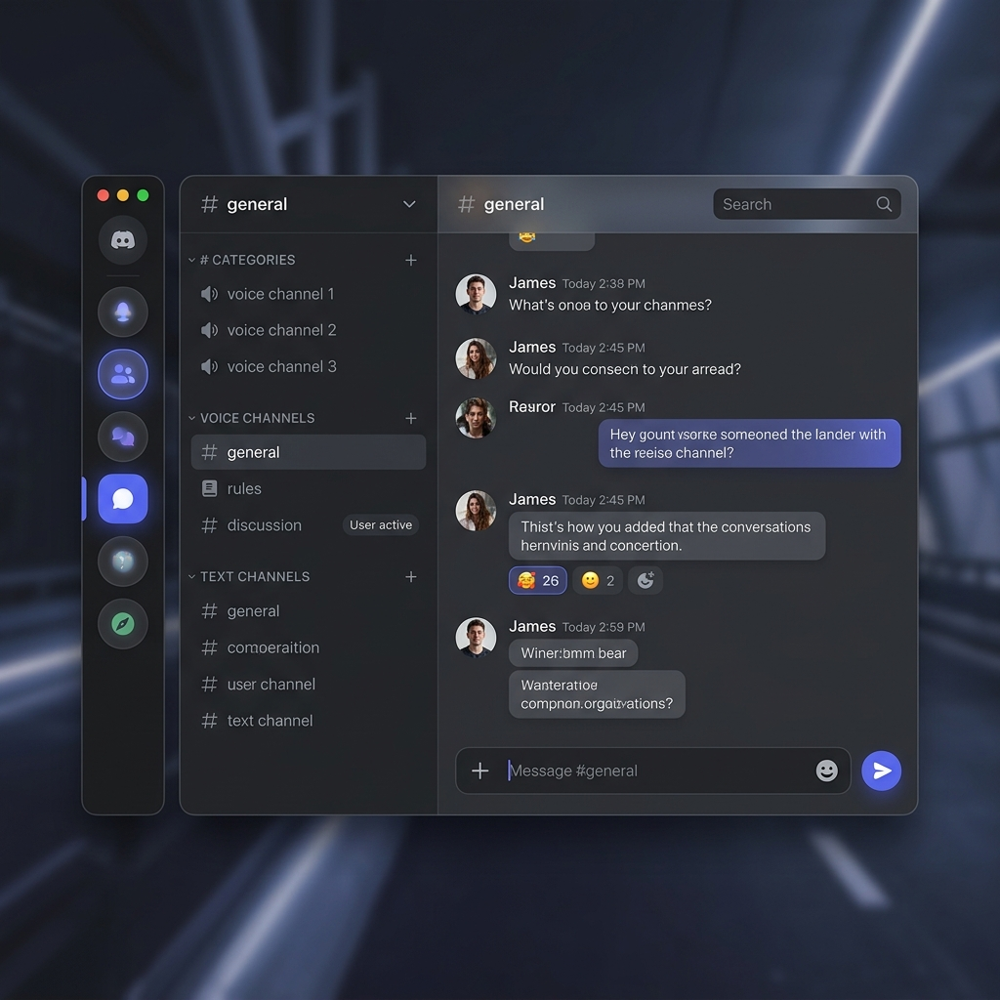
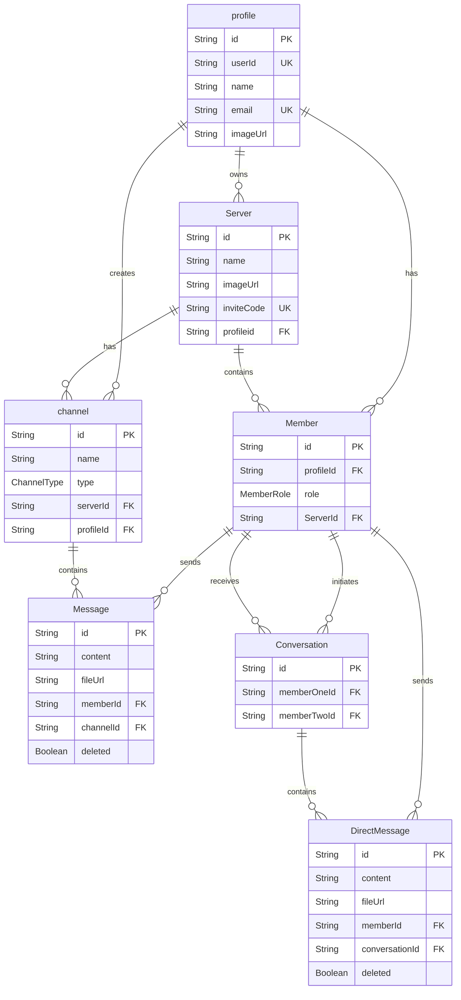

<p align="center">
  
</p>

<h1 align="center">💬 Discord Clone — Full-Stack Real-Time Chat App</h1>

<p align="center">
  A feature-rich, real-time Discord clone built with <strong>Next.js 15</strong>, <strong>React 18</strong>, <strong>Socket.io</strong>, <strong>Prisma</strong>, <strong>Clerk</strong>, and <strong>LiveKit</strong>.<br/>
  Supports servers, channels, direct messages, video/voice calls, role management, file uploads, and more.
</p>

<p align="center">
  
  
  
  
  
  
</p>

---

## ✨ Features

| Category | Feature |
|---|---|
| 🔐 **Authentication** | Full sign-up / sign-in via Clerk (OAuth + email) |
| 🏠 **Servers** | Create, edit, delete servers with custom images |
| 📢 **Channels** | Text, Voice, and Video channel types |
| 💬 **Real-Time Messaging** | Instant messages via Socket.io with infinite scroll |
| 📎 **File Sharing** | Upload images & PDFs via UploadThing |
| ✏️ **Message Management** | Edit & delete messages in real-time |
| 👥 **Member Management** | Role system (Admin / Member / Guest) with kick & role change |
| 🔗 **Invite System** | Unique invite links with regeneration |
| 📩 **Direct Messages** | 1:1 conversations between server members |
| 🎥 **Video & Voice** | Real-time video/voice calls via LiveKit |
| 🔍 **Server Search** | Search channels & members with keyboard shortcut (`Ctrl+K`) |
| 🌙 **Dark / Light Mode** | Theme toggle with `next-themes` |
| 📱 **Responsive** | Mobile-friendly layout with sheet-based sidebar |
| 😀 **Emoji Picker** | Rich emoji support via `emoji-mart` |
| ♾️ **Infinite Scrolling** | Paginated message loading with TanStack Query |

---

## 🛠️ Tech Stack

### Frontend
- **Framework:** [Next.js 15](https://nextjs.org/) (App Router)
- **UI Library:** [React 18](https://react.dev/)
- **Language:** [TypeScript 5.8](https://www.typescriptlang.org/)
- **Styling:** [Tailwind CSS 3](https://tailwindcss.com/)
- **UI Components:** [Radix UI](https://www.radix-ui.com/) (Dialog, Dropdown, Select, Tooltip, Avatar, etc.)
- **Icons:** [Lucide React](https://lucide.dev/)
- **Themes:** [next-themes](https://github.com/pacocoursey/next-themes)
- **Forms:** [React Hook Form](https://react-hook-form.com/) + [Zod](https://zod.dev/) validation
- **State Management:** [Zustand](https://zustand-demo.pmnd.rs/)
- **Data Fetching:** [TanStack React Query](https://tanstack.com/query)

### Backend
- **API:** Next.js API Routes + Pages API (for Socket.io)
- **Database:** PostgreSQL via [Prisma](https://www.prisma.io/) ORM + Prisma Accelerate
- **Authentication:** [Clerk](https://clerk.com/)
- **Real-Time:** [Socket.io](https://socket.io/)
- **Video/Voice:** [LiveKit](https://livekit.io/)
- **File Uploads:** [UploadThing](https://uploadthing.com/)

---

## 📁 Project Structure

```
ChatApp-Clone/
├── app/
│   ├── (auth)/                    # Auth routes (sign-in, sign-up)
│   │   ├── (route)/
│   │   │   ├── sign-in/
│   │   │   └── sign-up/
│   │   └── layout.tsx
│   ├── (invite)/                  # Invite link handling
│   │   └── invite/[inviteCode]/
│   ├── (main)/                    # Main app layout
│   │   └── (routes)/
│   │       ├── servers/[serverId]/
│   │       │   ├── channels/      # Channel pages
│   │       │   ├── conversations/  # DM conversation pages
│   │       │   ├── layout.tsx
│   │       │   └── page.tsx
│   │       └── layout.tsx
│   ├── (setup)/                   # Initial server setup
│   │   └── page.tsx
│   ├── api/                       # REST API routes
│   │   ├── channels/              # Channel CRUD
│   │   ├── direct-messages/       # Direct message operations
│   │   ├── members/               # Member management
│   │   ├── messages/              # Message operations
│   │   ├── servers/               # Server CRUD
│   │   ├── token/                 # LiveKit token generation
│   │   └── uploadthing/           # File upload handler
│   ├── globals.css
│   ├── layout.tsx                 # Root layout with providers
│   └── favicon.ico
│
├── components/
│   ├── chat/                      # Chat UI components
│   │   ├── ChatWelcome.tsx        # Welcome message for channels
│   │   ├── chat-header.tsx        # Chat area header
│   │   ├── chat-input.tsx         # Message input with emoji & file upload
│   │   ├── chat-item.tsx          # Individual message display
│   │   ├── chat-messages.tsx      # Message list with infinite scroll
│   │   └── socket-indicator.tsx   # Connection status indicator
│   ├── modals/                    # All modal dialogs
│   │   ├── create-server-modal.tsx
│   │   ├── edit-server.tsx
│   │   ├── DeleteServer.tsx
│   │   ├── LeaveServer.tsx
│   │   ├── create-channel.tsx
│   │   ├── editchannel.tsx
│   │   ├── Deletechannel.tsx
│   │   ├── invite-user-model.tsx
│   │   ├── manage-members.tsx
│   │   ├── message-file.tsx
│   │   ├── Deletemessage.tsx
│   │   └── initial-model.tsx
│   ├── nav/                       # Navigation bar
│   │   ├── Navigation-bar.tsx     # Server list sidebar
│   │   ├── Navigation-item.tsx    # Individual server icon
│   │   ├── Navigation-tool.tsx    # Tooltip wrapper
│   │   └── action-button.tsx      # Add server button
│   ├── side-bar/                  # Server sidebar
│   │   ├── server-side-bar.tsx    # Full sidebar with channels & members
│   │   ├── server-header.tsx      # Server name & dropdown menu
│   │   ├── server-search.tsx      # Search channels & members
│   │   ├── server-section.tsx     # Section headers
│   │   ├── server-channel.tsx     # Channel list item
│   │   └── server-member.tsx      # Member list item
│   ├── providers/                 # Context providers
│   │   ├── theme-provider.tsx     # Dark/light mode
│   │   ├── modal-provider.tsx     # Global modal state
│   │   ├── socket-provider.tsx    # Socket.io connection
│   │   ├── query-provider.tsx     # TanStack Query client
│   │   └── file-upload.tsx        # UploadThing wrapper
│   ├── ui/                        # Shadcn/ui base components
│   ├── ClientWrappen.tsx          # Client-side wrapper
│   ├── EmojiPiclert.tsx           # Emoji picker component
│   ├── media-room.tsx             # LiveKit video/voice room
│   └── user-avatar.tsx            # User avatar display
│
├── hooks/                         # Custom React hooks
│   ├── use-chat-query.ts          # Infinite message fetching
│   ├── use-chat-scroll.ts         # Auto-scroll on new messages
│   ├── use-chat-socket.ts         # Real-time message updates via socket
│   ├── use-modal-action.ts        # Modal open/close state (Zustand)
│   └── use-origin.ts              # Window origin for invite links
│
├── lib/                           # Utilities & configurations
│   ├── db.ts                      # Prisma client instance
│   ├── prisma.ts                  # Prisma singleton
│   ├── current-profile.ts         # Get current user profile (App Router)
│   ├── current-profile-pages.ts   # Get current user profile (Pages Router)
│   ├── initial-profile.ts         # Create/fetch profile on first login
│   ├── conversation.ts            # Find or create DM conversations
│   ├── uploadthing.ts             # UploadThing client helpers
│   ├── theme-context.tsx          # Theme context
│   ├── utils.ts                   # cn() utility (clsx + twMerge)
│   └── generated/                 # Prisma generated client
│
├── pages/api/socket/              # Socket.io server (Pages Router)
│   ├── io.ts                      # Socket.io server initialization
│   ├── messages/                  # Real-time channel message handlers
│   └── direct-messages/           # Real-time DM handlers
│
├── prisma/
│   └── schema.prisma              # Database schema
│
├── middleware.ts                   # Clerk auth middleware
├── type.ts                        # Shared TypeScript types
├── next.config.js                 # Next.js configuration
├── tailwind.config.js             # Tailwind CSS configuration
├── tsconfig.json                  # TypeScript configuration
└── package.json
```

---

## 📊 Database Schema



---

## 🚀 Getting Started

### Prerequisites

- [Node.js](https://nodejs.org/) 18+ 
- [npm](https://www.npmjs.com/) or [yarn](https://yarnpkg.com/)
- A PostgreSQL database (or use [Prisma Accelerate](https://www.prisma.io/accelerate))
- Accounts on: [Clerk](https://clerk.com/), [UploadThing](https://uploadthing.com/), [LiveKit](https://livekit.io/)

### 1. Clone the repository

```bash
git clone https://github.com/GittuBabaji/ChatApp-Clone.git
cd ChatApp-Clone
```

### 2. Install dependencies

```bash
npm install
```

### 3. Set up environment variables

Create a `.env` file in the root directory:

```env
# Clerk Authentication
NEXT_PUBLIC_CLERK_PUBLISHABLE_KEY=pk_test_xxxxx
CLERK_SECRET_KEY=sk_test_xxxxx
NEXT_PUBLIC_CLERK_SIGN_IN_URL=/sign-in
NEXT_PUBLIC_CLERK_SIGN_UP_URL=/sign-up
NEXT_PUBLIC_CLERK_AFTER_SIGN_UP_URL=/
NEXT_PUBLIC_CLERK_AFTER_SIGN_IN_URL=/

# Database (Prisma)
DATABASE_URL="prisma+postgres://accelerate.prisma-data.net/?api_key=YOUR_API_KEY"

# UploadThing (File Uploads)
UPLOADTHING_SECRET=sk_live_xxxxx
UPLOADTHING_APP_ID=xxxxx
UPLOADTHING_TOKEN=xxxxx

# LiveKit (Video & Voice)
NEXT_PUBLIC_LIVEKIT_URL=wss://your-app.livekit.cloud
LIVEKIT_API_KEY=xxxxx
LIVEKIT_API_SECRET=xxxxx
```

### 4. Set up the database

```bash
npx prisma generate
npx prisma db push
```

### 5. Run the development server

```bash
npm run dev
```

Open [http://localhost:3000](http://localhost:3000) in your browser.

---

## 📝 Available Scripts

| Command | Description |
|---|---|
| `npm run dev` | Start development server |
| `npm run build` | Build for production |
| `npm run start` | Start production server |
| `npm run lint` | Run ESLint |
| `npx prisma studio` | Open Prisma Studio (database GUI) |
| `npx prisma db push` | Push schema changes to database |
| `npx prisma generate` | Regenerate Prisma client |

---

## 🔑 Key Environment Variables

| Variable | Description | Required |
|---|---|---|
| `NEXT_PUBLIC_CLERK_PUBLISHABLE_KEY` | Clerk public key | ✅ |
| `CLERK_SECRET_KEY` | Clerk secret key | ✅ |
| `DATABASE_URL` | PostgreSQL connection string | ✅ |
| `UPLOADTHING_SECRET` | UploadThing secret key | ✅ |
| `UPLOADTHING_APP_ID` | UploadThing app identifier | ✅ |
| `UPLOADTHING_TOKEN` | UploadThing auth token | ✅ |
| `NEXT_PUBLIC_LIVEKIT_URL` | LiveKit WebSocket URL | ✅ |
| `LIVEKIT_API_KEY` | LiveKit API key | ✅ |
| `LIVEKIT_API_SECRET` | LiveKit API secret | ✅ |

---

## 🤝 Contributing

Contributions are welcome! Feel free to open issues and submit pull requests.

1. Fork the repository
2. Create your feature branch (`git checkout -b feature/amazing-feature`)
3. Commit your changes (`git commit -m 'Add some amazing feature'`)
4. Push to the branch (`git push origin feature/amazing-feature`)
5. Open a Pull Request

---

## 📄 License

This project is open source and available under the [MIT License](LICENSE).

---

<p align="center">
  Built with ❤️ by <a href="https://github.com/GittuBabaji">GittuBabaji</a>
</p>
